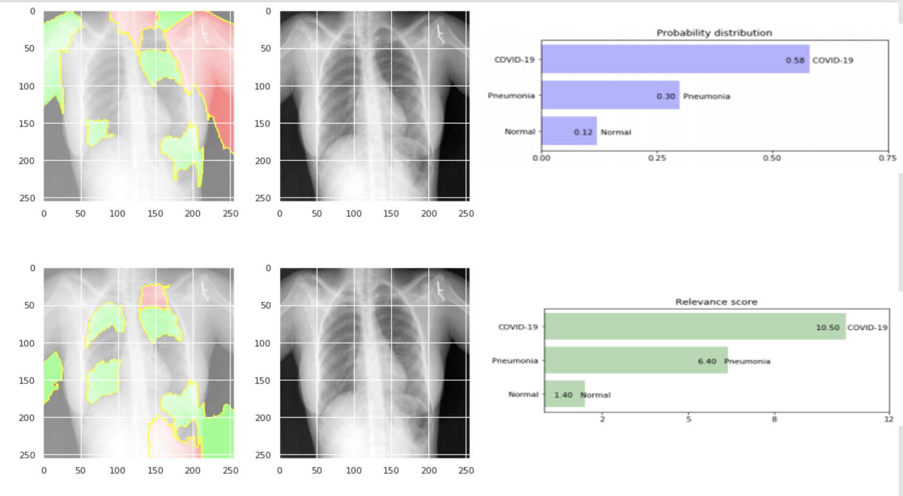

## Background

This research theme is focused in building human-centric explainable intelligent interfaces that can assist physicians in understanding the predictions of deep learning models in the medical diagnosis of chest X-ray images.

## Research Topics

This research theme aims to build a novel framework consisting of algorithms, models, techniques, and tools that i) support generating human-centric explanations from the machine learned predictions of chest X-rays, and ii) allow medical practitioners to interact with the reasoning underpinned by machine intelligence. The main research topics include but are not limited to:

- Investigate the incorporation of human classification patterns in deep learning frameworks
- Develop user-centric explainable intelligent user interfaces
- Generate persuasive human-centric explanations for medical diagnosis
- Develop new frameworks and tools to support human in the loop in medical diagnosis
- Develop human and application grounded evaluation protocols for XAI in medical diagnosis

## Publications

TODO: Add publications here
