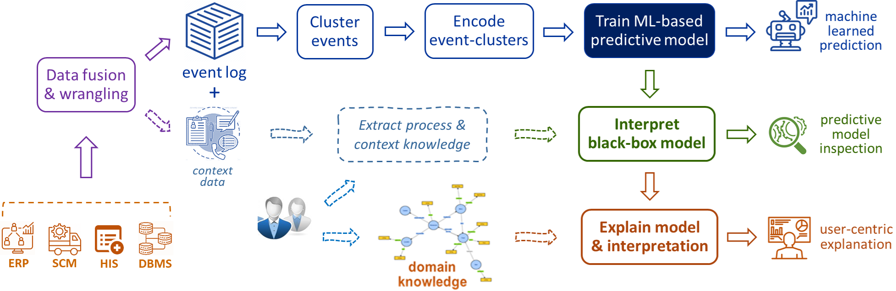

## Background

Predictive process analytics is a newly emerged discipline dedicated to providing business process intelligence in modern organisations. It uses event logs, which capture process execution traces in the form of multi-dimensional time-series data, as the key input to train process predictive models. These predictive models, often underpinned by machine learning (incl. deep learning) techniques, aim at predicting future states of a business process by learning from process execution history recorded in event log data. Typical examples of business process predictions include predicting next events to occur along process execution, outcomes that the execution of a business process may lead to, and the remaining time till the completion of process execution.

Whilst accuracy has been a dominant criterion in building predictive capabilities in process analytics, the use of advanced machine learning techniques as the underlying mechanism comes at the cost of the models being used as "black boxes" -- they lack explanations for users to understand their reasoning and as such they are unable to provide insights into why a certain business process prediction was made. Without explainability, it is hard for users to trust the reliability of a predictive model, let alone its predictions. This has led to establishment of the research theme on *explainable predictive process analytics*.

## Research Topics and Domains

The projects under this research theme aim to address the notions of explainablility and interpretability throughout the pipeline of predictive process analytics. These include but not limited to the following topics:

- Interpretability-oriented feature construction from event logs and relevant contextual data
- XAI-enabled inspection of process predictive models
- Building robust and interpretable models for process predictions
- Generating user-centric explanations for process predictions
- Evaluation of explainable methods for predictive process Analytics

The research theme is applied to a wide range of domains, including but not limited to:

- Healthcare
- Industrial IoT
- Agri-food industry
- Government sector
- Finance and Insurance

## Publications

TODO: Add publications here