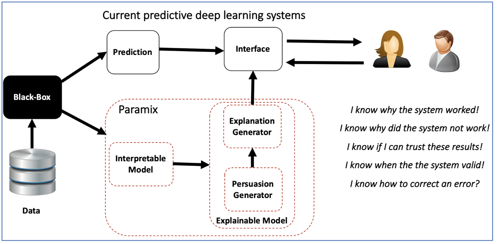

## Background

This research theme leverages on persuasive AI to provide trustful explanations for humans in deep learning models. Persuasive AI corresponds to the set of techniques to generate narratives that bring users meaningful changes in beliefs. Recently, interpretable models for explainable AI models that can extract sub-symbolic information from black-boxes were proposed in the literature. However, it remains an open research question on how to convert this symbolic information into human understandable explanations. We argue that persuasive AI has the potential to provide human-centric explanations that can increase the trust of a user in a prediction.

## Research Topics

This research proposes a novel approach to endow machine intelligence with capabilities to explain underlying predictive mechanisms to help users understand and scrutinize the system's decisions. These topics include:

- Construction of human centric explainable messages
- Build persuasive models for XAI
- Development of Human grounded evaluation protocols that take into consideration the persuasiveness of the system

## Publications

TODO: Add publications here
